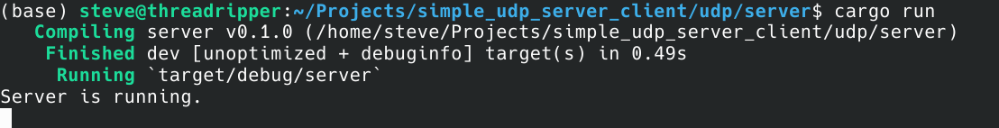
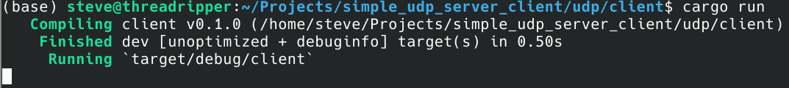
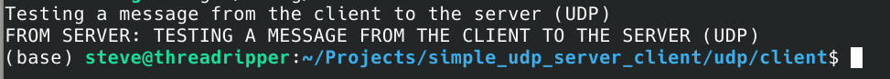
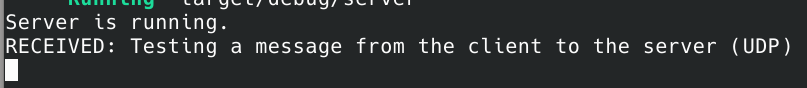
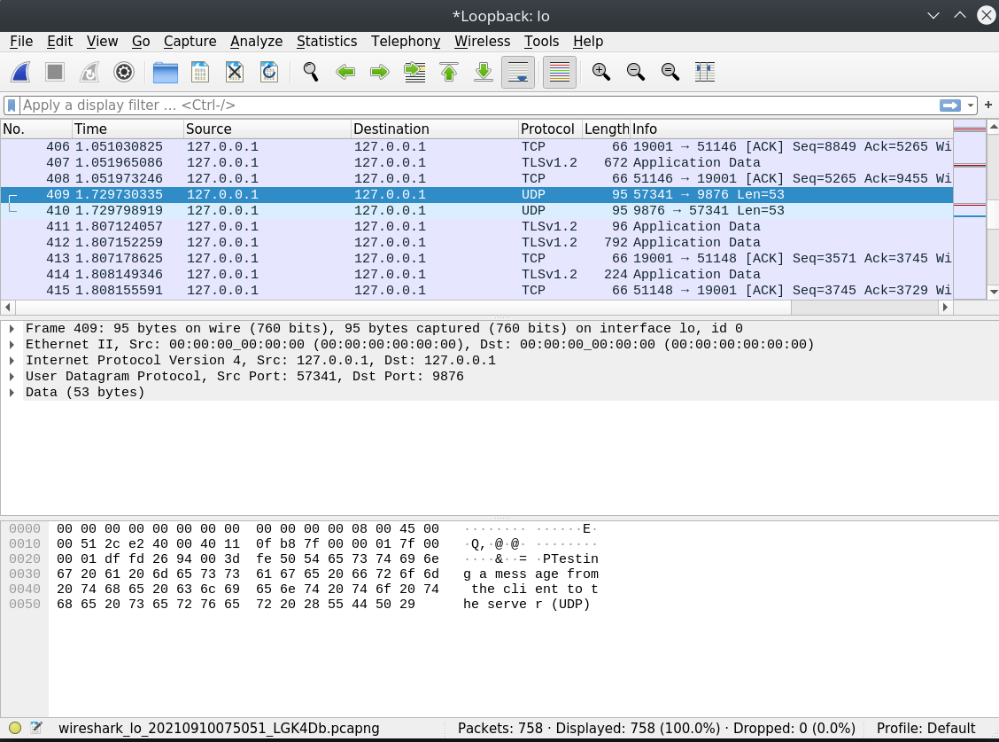
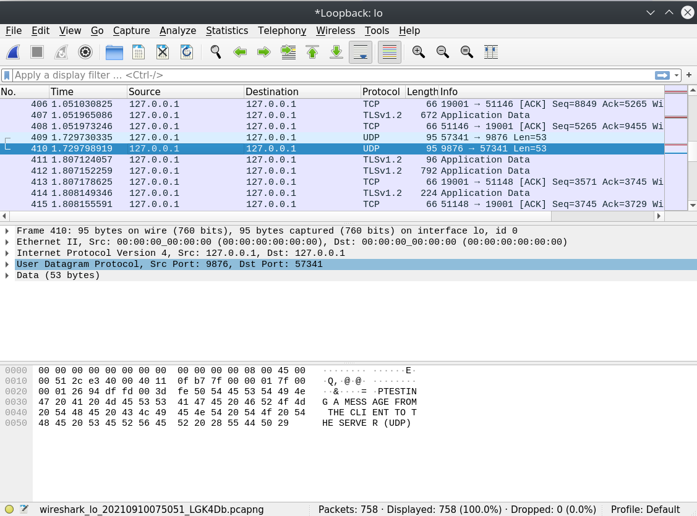

# Socket Programming with UDP

Simple activity around UDP and a simple client/server application. The client sends a user-supplied message to the server, the server outputs it and returns it in a capitalised form.

Original source code provided was in Java, this is an example of an approach in Rust.

## Installing Rust

If you don't have Rust installed on your system you can follow the instructions at [Installing Rust](https://www.rust-lang.org/tools/install), this code has been tested with Rust v1.55.0 on Ubuntu 20.04 but should work on Windows and MacOS too - if not, I'm happy to accept pull requests.

## UDP

Open your command prompt and navigate to the server directory and execute `cargo run`, this will start the server and you should see something like:

Once the server has started, open another terminal and naivagate to the client directory and execute `cargo run`, this will start the client and you should see something like:

To test the client, enter the message `Testing a message from the client to the server (UDP)` and press enter. You should receive the following output:

Now, take a look at the server output, it should appear like this:

You can close the server down with `Ctrl+C`, or start the client again to play around with more messages. To see what is being transmitted, take a look in [Wireshark](https://www.wireshark.org/), selecting loopback network. Here, as an example, we can see the transmitted data:

## TCP

There is a stretch goal of implementing a TCP version, you'll find this in the TCP folder, again with a client and server application.